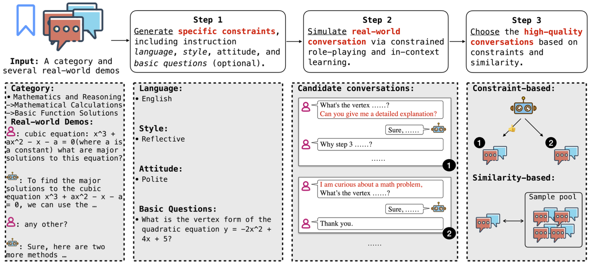

# Introduction

This repository contains data and evaluation code for the paper "DINGO: Towards Diverse and Fine-Grained Instruction-Following Evaluation". DINGO is a fine-grained and diverse instruction-following evaluation dataset that has two main advantages: (1) DINGO is based on a manual-annotated, fine-grained and multi-level category tree with 130 nodes derived from real-world user requests; (2) DINGO includes diverse instructions, generated by both GPT-4 and human experts.



# Evaluation

## Data Prepare
 The predicted results of the model need to be organized into a multi-level file format similar to `data/test_data`, and named as `data/{model_name}`, for example `data/llama-7B`. Specifically, for the sample format in `data/test_data` as follows, 

 ```sh
{
"id": "de7e3005f2004bbd",
"basic_question": "",
"reference_answer": "",
"conversations": [
    {
        "from": "human",
        "value": "Planning a road trip along the scenic coast of California. Interested in local delicacies, and photo-worthy spots. What's your suggested route and must-see stops?"
    },
    {
        "from": "AI",
        "value": "" # Fill in the response of your model here
    }
]
}
 ```

the model should fill in AI responses.

## Get Evaluation Score

You can choose either single answer grading or pairwise comparison. For a detailed explanation of the differences between the two, you can refer to [LLM-as-a-judge](https://github.com/lm-sys/FastChat/tree/main/fastchat/llm_judge).

- Single answer grading.

```sh
python single_evaluate.py --model_name {model name} --api_key {your openai api key}
```

- Pairwise comparison.

```sh
python pairwise_evaluate.py --modelA_name {modelA name} --modelB_name {modelB name} --api_key {your openai api key}
```

